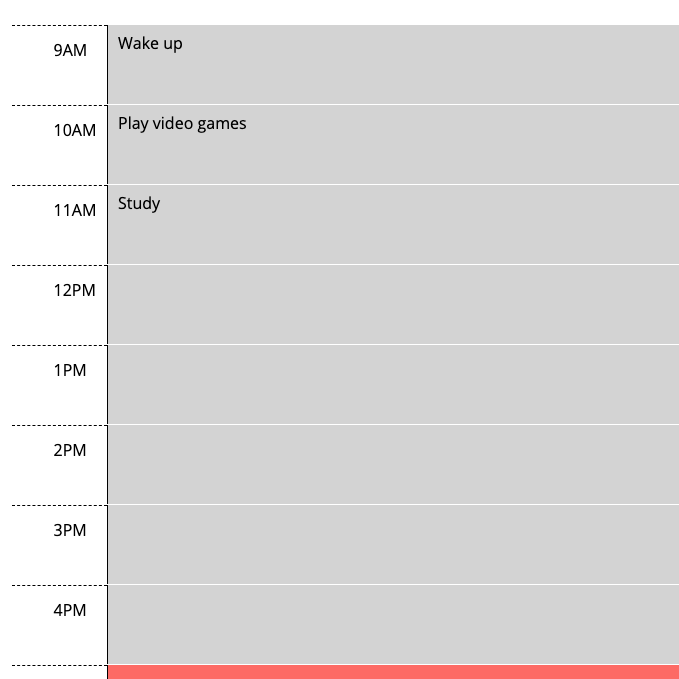

# Workday Scheduler

[Workday Scheduler Website](https://alxndryn.github.io/Work-Day-Scheduler/)

This project is an application available on the user's browser. It allows for the user to enter and store their tasks for the day. The timeframe is set to typical business hours (9am - 5pm).

Displayed at the top of the application is the current day. The user can enter text in a time block and, by clicking the time blocks respective save button, save that task to the local storage on their browser. The time blocks are color-coded: gray for past hours of the day, green for future hours, and red for the current hour.

By creating this project I have reinforced my understanding of storing information in local storage. This project has also introduced me to the moment.js library which in turn has required me to practice resourcefulness when learning to use unfamiliar coding tools.

## Built With
- [JQuery](https://jquery.com/) - JavaScript library
- [Moment.js](https://momentjs.com/) - JavaScript library for displaying dates and times

## Screenshot

